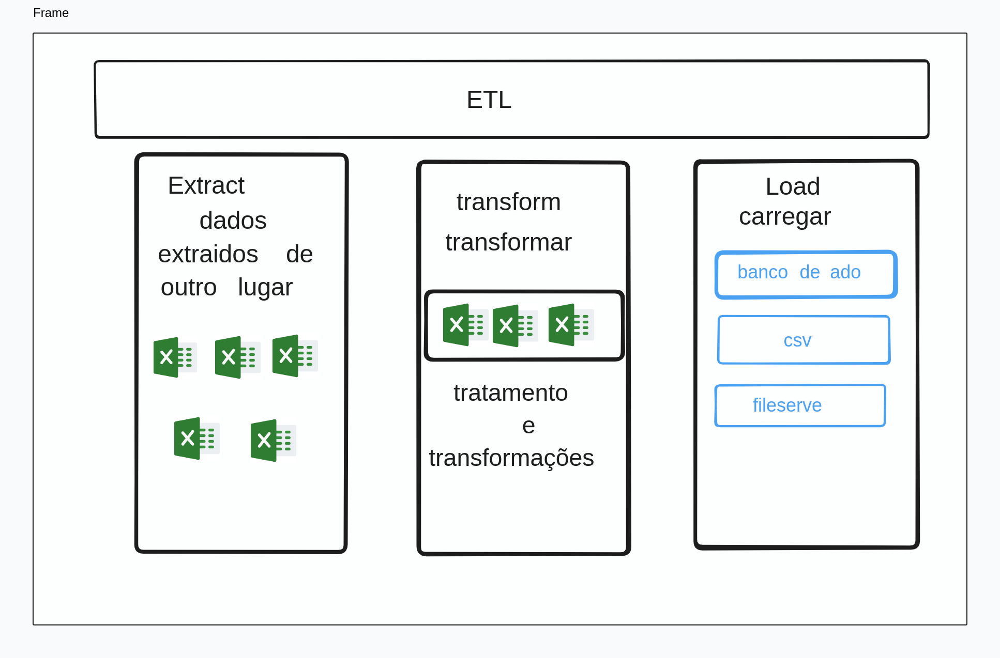

# ETL - Extrair, Transformar e CArregar

**ETL** significa  **Extrair, Transformar e Carregar** . É um processo fundamental na integração de dados, utilizado para reunir dados de diversas fontes e organizá-los em um formato unificado e utilizável para análise e tomada de decisões.

**Etapas do Processo ETL:**

1. **Extração:** Nesta etapa, os dados são coletados de suas fontes originais, como sistemas transacionais, bancos de dados, arquivos e APIs. É importante garantir a integridade e confiabilidade dos dados durante a extração.
2. **Transformação:** Os dados extraídos são então transformados para atender às necessidades do destino final. Isso pode envolver diversas operações, como limpeza de dados, formatação, normalização, agregação, enriquecimento e validação. O objetivo é garantir que os dados estejam consistentes, precisos e adequados para análise.
3. **Carregamento:** Os dados transformados são finalmente carregados no destino final, que pode ser um data warehouse, data lake, banco de dados analítico ou outro sistema de armazenamento de dados. O processo de carregamento deve garantir a integridade dos dados e evitar duplicação ou perda de informações.



---

**data raw** - todos os dados antes de qualquer processo de polimento ou processaento, é o dado na sua forma mais crua.

**data ready**  -  é quando o dado passou pelo seu processo de refiamento

blibiotecas instaladas:

- pandas

  ```
  pip install pandas
  ```
- openéxl

  ```
  pip install openexl
  ```
- Xlswriter

  ```
  pip intall xlswriter
  ```
